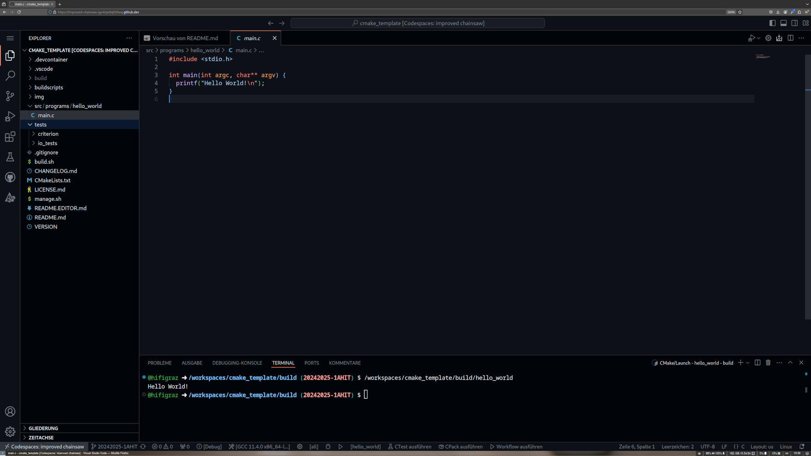
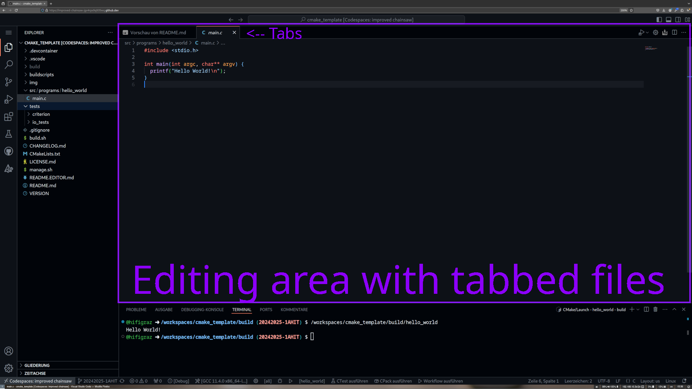
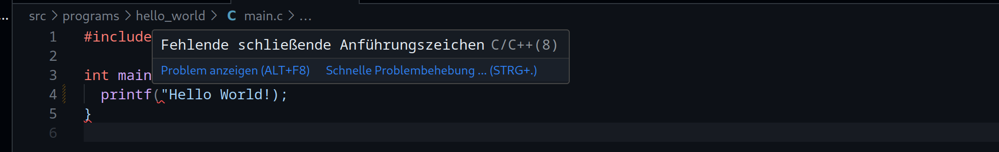

# Editor Description

In this file, you will find some information about how to use this development environment.

## Editor Overview

After starting a code-space from GitHub, you will result into an editor screen like the following:

This editor is separated into several areas:

### Operation Mode selection

On the left of the editor window, there is the operation mode selection.

Here you can choose between the different fundamental operation modes, like `file browsing`, `version control`, `debuging` and others.

### Sidebar

Just next to the operation mode selection, there is a sidebar with tools, specific to the chosen operation mode.

### Editing area

Most of the screen is taken up by the editing area. This is where you can actually edit your source files.

### Diagnostics

In this diagnostic area, several tasks can be done. Problems can be inspected, output can be watched, or programs can be run on terminals.

### Statusbar

In the status bar, one sees useful information about project state. Also, you can gain direct access for configuring, building and testing your project.

## Explorer Mode

Explorer mode

The default operation mode of this development environment is the explorer mode.
In this mode, you see a sidebar representing your project structure. 

For the first steps, it should be enough that, you know, your program resides in `/src/programs/<program_name>/main.c`

You can choose files for editing in this explorer, by clicking them.

You can add or remove files and folders in this mode. 

Folders can be collapsed and opened.

## Building and executing programs

To build and execute programs, please do only use the tools provided in the status bar at the bottom of your editor.

When configuring a project, which is only needed after the removal or addition of files and folders, you may be asked for a toolkit and build process, which should be used. In this case, please select the `gcc` toolkit and the `Debug` process, as shown in the figures below.

## Syntax errors

Searching for syntax errors isn't always easy in the beginning.
For example, in this program, there is a hard-coded string that never ends.
The compiler will not know what to do. So the error locations are marked by red lines.

If you move your mouse pointer to this error indication, you will get a hovering error description.

A list of detected problems in your project, can be shown in the diagnostics area of your editor. You can double-click on every problem, to open the affected file and navigate to the problem's location.

## Program output

After fixing all syntax errors and successfully building your program, you can execute it by using the described buttons in the status bar.

When everything goes well, you should see the output of your program in the diagnostics area.

